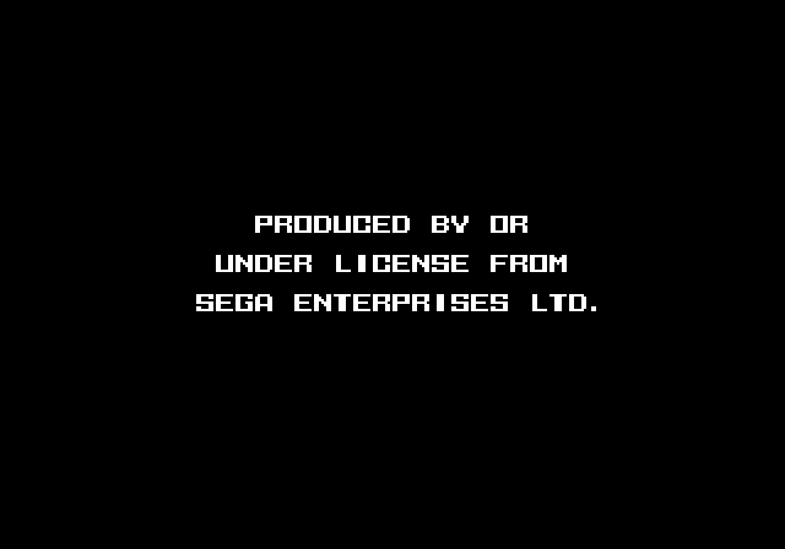
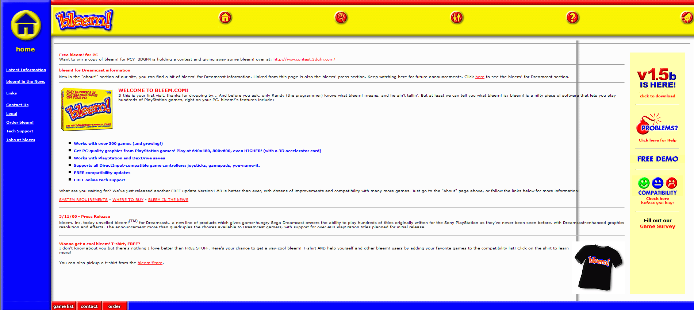
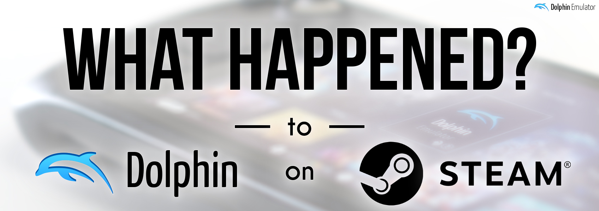
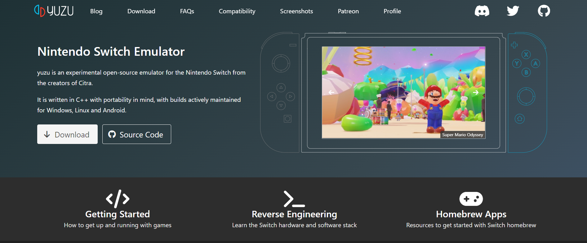
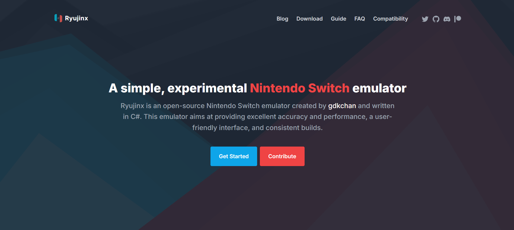

*All legal discussion is relevant to the United States only. Please don't use any of this as legal advice. If you find any errors with this article, please send an email to [a@stalereference.com](mailto:a@stalereference.com). Credit to Arstechnica for the inspiration for the cover photo, Ryujinx for the logo itself, and the sources below.*

On October 1st 2024, GDKChan was contacted by Nintendo and given an agreement to stop work on the Nintendo Switch emulator Ryujinx and remove the organization and all related assets, according to Ryujinx developer riperiperi. Ryujinx was still in [heavy development](https://x.com/RyujinxEmu/status/1841188744126480428) (including work on iOS/Android ports, native applets, and a metal backend) when the project ceased development. However, it didn't stay in the news for long, likely since Yuzu was taken down months earlier; I was shocked to see Nintendo essentially take Switch emulation offline, even with their previous actions, since I thought emulation protections would be stronger (as it turns out, this will be a complicated question to answer). Few good discussions are talking about the intersection of emulation and legality (Moon Channel and Hoeg Law's videos are two exceptions to this) so hopefully this gives a better context for emulation. Let's get into it!

## Table of Contents
- [Table of Contents](#table-of-contents)
- [Why is (Switch) Emulation Development Important?](#why-is-switch-emulation-development-important)
- [History Time! Sega, Sony, and Establishing Fair Use via Reverse Engineering](#history-time-sega-sony-and-establishing-fair-use-via-reverse-engineering)
  - [1992: Sega vs. Accolade, (Lawsuit)](#1992-sega-vs-accolade-lawsuit)
  - [2000: Sony vs. Connectix, (Lawsuit)](#2000-sony-vs-connectix-lawsuit)
  - [2000: Sony vs. Bleem!, (Lawsuit)](#2000-sony-vs-bleem-lawsuit)
- [Things Aren't So Settled: The Digital Millenium Copyright Act](#things-arent-so-settled-the-digital-millenium-copyright-act)
- [Nintendo's Actions against Emulators](#nintendos-actions-against-emulators)
  - [2023: Valve taking down Dolphin under Nintendo's Direction](#2023-valve-taking-down-dolphin-under-nintendos-direction)
  - [2024: Nintendo vs. Tropic Haze (Yuzu)](#2024-nintendo-vs-tropic-haze-yuzu)
- [Why the Recent Action against Ryujinx is a Big Deal](#why-the-recent-action-against-ryujinx-is-a-big-deal)
- [What Can Be Done?](#what-can-be-done)
- [Sources and Footnotes](#sources-and-footnotes)

## Why is (Switch) Emulation Development Important?

**Short Term Benefit**: Users have a right to software interoperability. All modern computing platforms have creative and functional elements. For a given software program, a user should have the choice of platform (which recreates the functional elements) following fair use (whether it be on original hardware or an emulator). 

**Long Term Benefit**: All media is temporary. [87% of classic video games are unavailable for purchase](https://gamehistory.org/87percent/). Regardless of what lobbying groups (the Entertainment Software Association) or computer manufacturers say, it's not feasible or even expected that a company should invest in commercially unviable projects to preserve its past. Open-source emulation is the only effective method for preserving software[^emulation_wait].

## History Time! Sega, Sony, and Establishing Fair Use via Reverse Engineering 

### 1992: [Sega vs. Accolade](https://www.copyright.gov/fair-use/summaries/segaenters-accolade-9thcir1992.pdf), ([Lawsuit](https://casetext.com/case/sega-enterprises-ltd-v-accolade-inc-2))

*The Sega TMSS Screen*

This lawsuit ended up being one of the most impactful for codifying reversing engineering for functional elements as a fair use defense for copyright infringement. In 1998, Sega released the Sega Genesis and required third party devs pay a licensing fee and exclusively publish for Sega. In 1990, Sega released the Genesis III and implementing the TMSS (Trademark Security System): initialization code that checked for the letters "SEGA" before allowing a cartridge to run.

Game development company Accolade, wanting to avoid the exclusivity agreement, first reverse-engineered three Genesis cartridges by decompiling them and wrote a specification manual that contained the Genesis-compatible requirements. As a result, Accolade added this code to their own self-published games. When the Genesis III was released, Accolade added the TMSS code as a header file for all its games. 

In 1991, Sega pursued legal action against Accolade for trademark infringement, unfair competition, and copyright infringement; Accolade argued that its use constituted fair use. The district court sided with Sega so Accolade appealed to the 9th circuit. The appeals court agreed with Accolade's claim of fair use, reversed it's preliminary injunction and ruled Accolade's decompilation fair use; **disassembly of a copyrighted work is fair use if necessary to get access to functional elements of the work**.

Claims:

1) Trademark infringement: the "SEGA" trademark can't be used to limit competition
2) Copyright infringement: the TMSS file was substantially smaller than original game content and there is a public benefit to compete with Sega; furthermore, the TMSS contains functional elements which aren't under protection.

### 2000: [Sony vs. Connectix](https://www.copyright.gov/fair-use/summaries/sony-connectix-9thcir2000.pdf), ([Lawsuit](https://caselaw.findlaw.com/court/us-9th-circuit/1452245.html))

In 1994, Sony released the PlayStation in Japan and, [based on a cheap price, 3D graphics, a strong game library, and adolescent marketing](https://expertbeacon.com/why-did-the-ps1-do-so-well/), sold over 100 million systems. Four years later in San Mateo, California, [Aaron Giles](https://aarongiles.com/) at Connectix started working on the Virtual Game Station (VGS), an emulator to run PlayStation games on Mac hardware. Giles and Eric Traut initially showed Sony the product but Sony refused to license its BIOS. Therefore, Connectix engineers reversed-engineered the BIOS by extracting it from the Sony chip and observed how it interacted with the VGS. In 1999, it was shown at Macworld Expo. 


*Reveal of the Connectix VGS at Macworld*

Sony, with support from Nintendo, Sega, and 3dfx, filed a lawsuit based on claims of copyright infringement and trademark tarnishment. The District Court sided with Sony and issued a preliminary injunction again Connectix, but the Ninth Circuit Court of Appeals reversed both claims and lifted the injunction after showing that Connectix's use of the BIOS was legal. Despite this, the cost of continuous litigation led Connectix to settle and hand over its code to Sony. 

Some highlights from the suit:

1) **Emulation is taken as legal**: *"Software engineers designing a product that must be compatible with a copyrighted product frequently must “reverse engineer” the copyrighted product to gain access to the functional elements of the copyrighted product."*
2) **Connectix is a valid competitor to the PlayStation**: As discussed in the potential market impact for fair use, *"Sony understandably seeks control over the market for devices that play games Sony produces or licenses. The copyright law, however, does not confer such a monopoly"*.
3) **Connectix copying the BIOS for the purposes of reverse engineering is legal**: as stated in factor 1 for fair use, it's necessary to get access to the unprotected/functional elements of Sony's hardware.

### 2000: [Sony vs. Bleem!](https://www.copyright.gov/fair-use/summaries/sonycomputer-bleem-9thcir2000.pdf), ([Lawsuit](https://casetext.com/case/sony-computer-entertainment-america-v-bleem))

*Bleem's original homepage (seen via [Protoweb](https://protoweb.org/))*

While Connectix was being developed, Randy Linden (computer programmer who ported Doom to the SNES and Dragon's Lair to the C64) and David Herpolsheimer (marketing with IBM, Kodak, and Apple) began work on Connectix. With PC-exclusive enhancements (improved resolutions, anti-aliasing), the team at Bleem! envisioned it could be an easy way for developers to port their PlayStation games to PC. Sony disagreed and sued them over copyright infringement over the usage of screenshots for comparative advertising; while the district court ruled in favor of Sony and set up a preliminary injunction against Sony, the appeals court overturned this. 

**The court asserted Bleem as a competitor to Sony and ruled Bleem's use of screenshots was for comparative advertising and thus fair use**: *"If sales of Sony consoles drop, it will be due to the Bleem emulator's technical superiority over the PlayStation console, not because Bleem used screen shots to illustrate that comparison"*. 

Again, Bleem wins this case but again, Sony continues to sue. Linden goes to Sony. Herpensheimer, disaffected by the loss of the company and his colleagues leaving to Sony, leaves the software industry [^herpenshimer_quote].

## Things Aren't So Settled: The Digital Millenium Copyright Act

So reading this so far, you probably think reverse engineering for the purposes of creating an emulator is a slam dunk. Unfortunately, things will get more complicated. In 1998, the Digital Millennium Copyright Act (DMCA) was passed; while there were three main provisions, Section 1201 (anti-circumvention) is most relevant: it prevents circumvention of technological protection measures and trafficking tools primarily designed to aid this. 

There is a reverse engineering exemption, 1201(f), permitting cicrcumvention and making the information/tooling public in the pursuit of achieving interopability of an independently created program. However, there have been very few cases that cite this exemption, leaving little precedent to predict future cases.
- In [Davidson Associates v. Jung](https://casetext.com/case/davidson-associates-v-jung), where Blizzard successfully sued the lead developers of the bnetd third party client; relevant is that the exemption was invalid here since the software allowed non-genuine Blizzard software to function. However, there are other stipulations (including that the developers signed a EULA waiving their fair use rights) that make it difficult to directly apply this[^eff_bnetd].
- In [Apple v. Corellium](https://www.copyright.gov/fair-use/summaries/appleinc-corellium-sdfla2020.pdf) (Corellium created virtualization software for the iPhone), Judge Rodney Smith threw out the copyright infringement claims but didn't issue a summary judgment for Apple's DMCA claim; he opined that based on prior rulings, there would need to be a balanced approach between Section 1201 and fair use, [much to the chagrin of the EFF](https://www.eff.org/deeplinks/2021/02/section-1201s-harm-security-research-shown-mixed-decision-corellium-case). However, Apple and Corellium settled the DMCA claim back in 2021 so this question never got resolved. 

## Nintendo's Actions against Emulators

Nintendo has negatively spoken out and taken actions against emulators ever since they threatened legal action against UltraHLE, a Nintendo 64 emulator, in 1999.[^nintendocomments]

### 2023: Valve taking down Dolphin under Nintendo's Direction

*[Image from Dolphin Emulator's article on Steam takedown](https://dolphin-emu.org/blog/2023/07/20/what-happened-to-dolphin-on-steam/)*

When Dolphin, a Nintendo Gamecube/Wii emulator, announced it was coming to Steam, Valve's legal department contacted Nintendo for their approval. In response, Nintendo sent a letter to Valve which forwarded it to Dolphin stating that the emulator violates section 1201 of the DMCA by circumventing a technological protection measure by including the Wii Common Key (cryptographic keys used to decrypt Wii games at runtime). Dolphin emulator countered by stating that it squarely fell under the reverse engineering exemption stating Dolphin circumvents Wii disc encryption for interoperability with Wii games. Furthermore, they cite that the exemption permitting the sharing of derived information from reverse-engineering on including the common key in the emulator. 

Since there was no legal action, there wasn't any precedent set. However, it foreshadowed the leanings of Nintendo's actions against emulators.

### 2024: [Nintendo vs. Tropic Haze (Yuzu)](https://s3.documentcloud.org/documents/24444407/nintendo-sues-yuzu-emulator.pdf)

*Yuzu's homepage before it was shutdown*

On February 26th, 2024, Nintendo filed a suit against Yuzu making claims of copyright and DMCA infringements, marking the first time the company took legal action against an emulator. Bunnei, previously the co-creator of Citra (3DS emulator) created the open-source Nintendo Switch emulator Yuzu, managed by Rhode Island-based Tropic LLC. Its patreon eventually grew to $30,000 (spiking when *The Legend of Zelda: Tears of the Kingdom* was released) and was compatible with around 1872 games. Rather than attempting to fight the suit, Tropic Haze settled with Nintendo for $2.4 million and stopped the development and distribution of all Yuzu and Citra-related source code. 

However, it's important to see the potential legal arguments that Nintendo or another company would make in a future emulation lawsuit. Most of the arguments the plaintiff or defendent would make are untested so I can only speculate. I'll separate Nintendo's 5 counts into three groups.

1) **Trafficking of circumvention technology** (2 counts)
    - Tropic Haze is trafficking its tool, Yuzu, which is primarily designed to circumvent game encryption
    - Quickstart guide links to tools is trafficking of console circumvention tools
2) **Circumvention of technological protection measures** (1 count)
    - Game (title.key)/console decryption (prod.keys)
3) **Reproducing/distributing protected works** (2 counts)
    - Dumping game ROMs is copyright infringement 
    - Some Yuzu developers downloaded ROMs or shared ROMs with each other 
    - Yuzu responsible for its users' infringement

Notice that Nintendo's strategy is primarily to demonstrate DMCA violations rather than copyright infringement (ala Connectix/Bleem) since copyright has stronger fair use protections but the DMCA reverse engineering exemption is narrower and mostly untested. In particular, citing Richard Hoeg, the trafficking claim is the strongest, specifically with Nintendo citing the quickstart guide (links decryption tools including TegraRcmGUI, Lockpick_RCM, and NXDumpTool) as evidence of Tropic Haze trafficking (spreading) circumvention tools [^richardhoeg_video]. It's a novel theory, however, and there may be a corresponding novel defense that could cite 1201(f) or even fair use.

On the other hand, I would argue that Nintendo claiming that Yuzu is primarily a circumvention tool is a stretch (it's an emulator!). Furthermore, bypassing console TPMs is more likely clear based on section 1201(f); decryption of game files (and dumping in general) is greyer. I would argue the claims about copyright (minus the negligent behavior of some of the Yuzu developers) are less strong based on the decades of legal precedent and the fact that Yuzu took some steps to distance itself from piracy (piracy discussion was banned in its Discord server, had a guide to dump games though Nintendo argues this is illegal). 

## Why the Recent Action against Ryujinx is a Big Deal

*Ryujinx's homepage*

This takes us to the recent takedown of Ryujinx. There is a mess of tangled, difficult, and untested text to decipher through the DMCA. However, Nintendo is attempting to use novel legal theories to shift the balance of the DMCA against the decades of reverse engineering precedent. Ryujinx and Yuzu's takedowns further demonstrate that open source codebases don't provide a shield from litigation. Finally, the issue wasn't Yuzu specific but emulation that relies on decryption mechanisms (in other words, all modern game emulation [^emulation_keys]). Finally, a couple of sentiments to address:

- *"Switch emulation should go undercover"*: No! The Ryujinx software engineers, [including gdkchan, Ac_K, riperiperi, LDj3SNuD, emmauss, Moosehunter, TSRBerry, Yoshiyes](https://ryujinx.org/) who develop open source emulation should be respected, praised and well-known. This isn't a user pirating video games. In many decades, when the Nintendo Switch storefront is long dead and its game consoles begin to fail, game emulation software created by these developers will be the only mechanism to play this software.
- *"Emulators should hold off on advertising themselves, being funded via Patreon, showing screenshots/video announcements/etc"*: The current precedent is all based on commercial emulation projects and courts have deferred on the side of the emulation developers when it comes to copyright/fair use; therefore, Nintendo's legal approach wouldn't change much (not to say emulation developers shouldn't take any precautions).

## What Can Be Done?

This is worth its own article but three ideas briefly:

- **Legal support**: whether it be receiving funds from digital rights organizations including the EFF, the emulation developers themselves allocating their money into a legal fund, and/or a nonprofit that directly deals with emulation legality, this would actually let emulation developers survive court cases.
- **Legislation**: DMCA exemptions for stronger protections for emulation/interoperability and game/software dumping
  - Every three years, the copyright office considers [temporary exemptions to the DMCA](https://www.copyright.gov/1201/) to *"determine whether there are particular classes of works as to which users are, or are likely to be in the next three years, adversely affected in their ability to make noninfringing uses due to the prohibition on circumventing access controls"*. The public hearings for the last session was this year (the final rule hasn't released yet) and the next session is in 2027.
  - The [Software Preservation Network](https://www.softwarepreservationnetwork.org/) and the [Library Copyright Alliance](https://www.librarycopyrightalliance.org/) have both submitted petitions previously to improve protections for offsite game libraries [^offsite_exemption].

I'll end off hoping for a better understanding and awareness of these issues of game preservation and interoperability. I sometimes feel disconnected from online discussions since it isn't constructive - oftentimes, it's lamenting that Nintendo or another company took a negative action against emulation and then a rallying cry to boycott the company... until 6 months later. If there's one thing to take away (besides thank you for reading this far!), it's to talk about about the values of emulation in terms of preservation and playability and the specific legal bottlenecks facing it. If so, emulation could strengthened and taken to greater heights.

## Sources and Footnotes

- [A Yuzu Post-Mortem: The Great Emu-War](https://www.youtube.com/watch?v=7rzWR9JP1WE)
- [Legal Status of Emulation, Emulation General Wiki](https://emulation.gametechwiki.com/index.php/Legal_status_of_emulation)
- [The history of bleem!, Eurogamer](https://www.eurogamer.net/the-history-of-bleem)
- [Programming War Stories: Connectix, Aaron Giles Personal **Website**](https://aarongiles.com/programming/war-connectix/)
- [DMCA - Copyright.org](https://www.copyright.gov/dmca/)
- [DMCA - Cornell Legal Information Institute](https://www.law.cornell.edu/uscode/text/17/1201)

[^moonchannel_dolphin]: [Why Are Emulators Legal? Dolphin vs. Nintendo, and the Fate of Emulation [Great Emu War Pt. 1]](https://www.youtube.com/watch?v=wROQUZDCIMI)

[^richardhoeg_video]: [Nintendo vs. Yuzu | A Legal Look at Emulation and the DMCA, Hoeg Law](https://www.youtube.com/watch?v=ijljctHpDfI)

[^emulation_wait]: You can't wait until the Nintendo Switch is dead to start emulation development. It's needed to start when there is more interest especially since emulation is (almost) never finished. Imagine if Nintendo sent a takedown against [Exzap](https://github.com/Exzap) to stifle Cemu and Wii U emulation was permanently crippled (like most Microsoft consoles). The library of games would have been limited to the original hardware.

[^herpenshimer_quote]:["I was ready to build a bunker and fill it with canned food because if this was how the world worked, I didn't want anything to do with it."](https://www.eurogamer.net/the-history-of-bleem)

[^nintendocomments]: Nintendo previously had a [webpage](https://archive.ph/aTJpk#selection-975.0-975.37) where it discussed game emulation and ROMs; case in point, it states the *"introduction of emulators created to play illegally copied Nintendo software represents the greatest threat to date to the intellectual property rights of video game developers"*. They released a newer page on [Intellectual Property](https://en-americas-support.nintendo.com/app/answers/detail/a_id/55888/~/intellectual-property-%26-piracy-faq) where the language was softened but still showed a harsh stance: *While we recognize the passion that players have for classic games, supporting emulation also supports the illegal piracy of our products*.

[^eff_bnetd]: [Coders’ Rights Project Reverse Engineering FAQ, EFF](https://www.eff.org/issues/coders/reverse-engineering-faq)

[^emulation_keys]:[Emulators and bundling crypto keys: is it common? is it illegal?, delroth's homepage](https://delroth.net/posts/emulation-crypto-keys-copyright-dmca/)

[^offsite_exemption]: [2021 Final Rule - Exemption to Prohibition on Circumvention of Copyright Protection Systems for Access Control Technologies, page 6](https://www.govinfo.gov/content/pkg/FR-2021-10-28/pdf/2021-23311.pdf).
